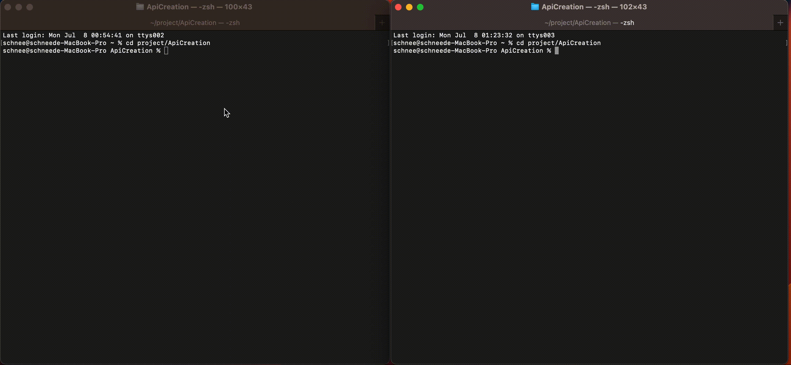

# ApiCreation

## How To Run It

### Using Make Command

1. **Run locally:**
   1. Open your terminal.
   2. Clone the repository:
      ```
      git clone git@github.com:hhhhp52/ApiCreation.git
      ```
   3. Navigate to the project directory:
      ```
      cd ApiCreation
      ```
   4. Execute the command:
      ```
      python3 -m flask --app main run
      ```
      or
      ```
      make run-local-service
      ```

2. **Run using Docker:**
   1. Open your terminal.
   2. Clone the repository:
      ```
      git clone git@github.com:hhhhp52/ApiCreation.git
      ```
   3. Navigate to the project directory:
      ```
      cd ApiCreation
      ```
   4. Ensure Docker is installed on your system.
   5. Build the Docker image:
      ```
      make build-image
      ```
   6. Run the Docker container:
      ```
      make run-service
      ```
    7. If you want to restart without rebuilding the image, start from step 6. If you need to rebuild the image, start from step 5.

---

## Directory Structure

- **ApiCreation/**
  - `.gitignore`: Ignores files not pushed to GitHub.
  - `Dockerfile`: Defines the Docker image configuration.
  - `Makefile`: Provides convenient commands for execution.
  - `requirements.txt`: Specifies Python package dependencies and versions.
  - `main.py`: Main entry point and primary code file.

## Example GIF

